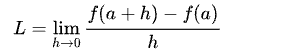

# Macrograd

Macrograd is a tiny scalar-valued automatic differentiation engine written in Python. It's a simplified implementation of the core ideas behind backpropagation, inspired by Andrej Karpathy's [micrograd](https://github.com/karpathy/micrograd).

This project is for educational purposes, to understand how automatic differentiation and backpropagation work under the hood.


## Features

*   A `value` class that represents a scalar value and builds a computational graph.
*   Overloaded arithmetic operators (`+`, `*`, `**`, etc.) to create complex expressions.
*   Graph visualization using `graphviz` to see the structure of the computation.

## Core Concepts

### The `value` class

The `value` class is the heart of Macrograd. It's a simple object that holds a single scalar value and keeps track of the operation that created it, and the "children" (the values that were used to create it).

```python
class value:
    def __init__(self, data, _children=(), _op=''):
        self.data = data
        self._prev = _children
        self._op = _op
```

When you perform an arithmetic operation on `value` objects, a new `value` object is created, forming a computational graph.

### Backpropagation (To be implemented)

The goal of this project is to implement backpropagation to automatically calculate the gradients of all nodes in the computational graph. This is done by applying the chain rule recursively from the output node back to the input nodes.

The `grad` attribute of the `value` class will store the gradient of that value with respect to the final output.

### Derivative Formula

The derivative of a function `f(x)` at a point `a` can be defined as:



This formula represents the instantaneous rate of change of the function at that point. In machine learning, we use derivatives (gradients) to update the parameters of a model to minimize a loss function.

## Usage

To use Macrograd, you can create `value` objects and perform arithmetic operations on them:

```python
from macrograd import value

a = value(2.0, label='a')
b = value(-3.0, label='b')
c = value(10.0, label='c')

d = a * b + c
```

You can then visualize the computational graph:

```python
from macrograd import draw_dot

draw_dot(d).render('graph', view=True)
```

## To-Do

*   Implement the `backward()` method in the `value` class to perform backpropagation and calculate gradients automatically.
*   Add support for more activation functions (e.g., `tanh`, `relu`).
*   Build a small neural network library on top of Macrograd.
